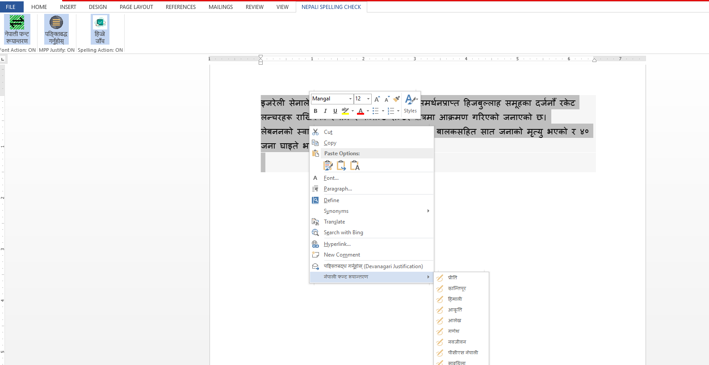

# Font-Encoding-Conversion-Add-in-C#-MS-Word

Devanagari script in the Nepali language is written using different encodings, including single-byte (TTF) and multi-byte (Unicode). As a result, various text formats exist. To enable further processing, text in different encodings needs to be converted into a unified format. This tool is designed to facilitate conversion between different Nepali Devanagari encodings.

This tool has been developed as an add-in for MS Word. It uses a remote REST API call to "https://hijje.com" for the conversion process. The document's formatting is maintained while converting the selected text's font and completely written in C# language.

### Core Implementation
```C#
        /// <summary>
        /// Perform replacement of text after font conversion.
        /// </summary>
        /// <param name="fontNameControl"></param>
        /// <param name="CancelDefault"></param>
        private void FontConversionEventHandler(CommandBarButton fontNameControl, ref bool CancelDefault)
        {
            /* *
             * Initialize current range before processing.
             * */           
            Word.Range workingRange = this.currentSelection.Range.Duplicate;
   
            /* *
             * Perform conversion as well as render the converted text here. If the system is unable to make converstion, 
             * it leaves such section to the original one.
             * */
            String targetFont = COMUtility.ServerFontNameOf(fontNameControl.Caption);
            List<SayakConversion> successConversions = CollectConversionRanges(workingRange)
                .Select(conversionRange => PerformFontConversion(conversionRange, targetFont))
                .Where(converstion => !converstion.IsEmpty())
                .ToList();

            /* *
             * Check if there are some messages from the server part to show the client like,
             * subscription expired or payment not happened yet.
             * In such case, there will be message shown to redirect the Sayak web site.
             * */
            if (successConversions.Any(result => result.IsFailedStatus())) {
                SayakConversion sayakConversion = successConversions.Find(conversion => conversion.IsFailedStatus());
                Tuple<String, String> remoteURLMessage = sayakConversion.BuildRemoteURLMessage();
                DialogResult result = MessageBox.Show(remoteURLMessage.Item2, FontPluginLiterals.SAYAK_SERVICE_NAME, MessageBoxButtons.YesNo, MessageBoxIcon.Asterisk);
                if (result == DialogResult.Yes) System.Diagnostics.Process.Start(remoteURLMessage.Item1);
            }
            workingRange.Select();
        }
```

### Output: 

The ouput after installation in MS Word is shown here.


### Further:

If really like to go deep in our font conversion work, you can follow this paper. 


